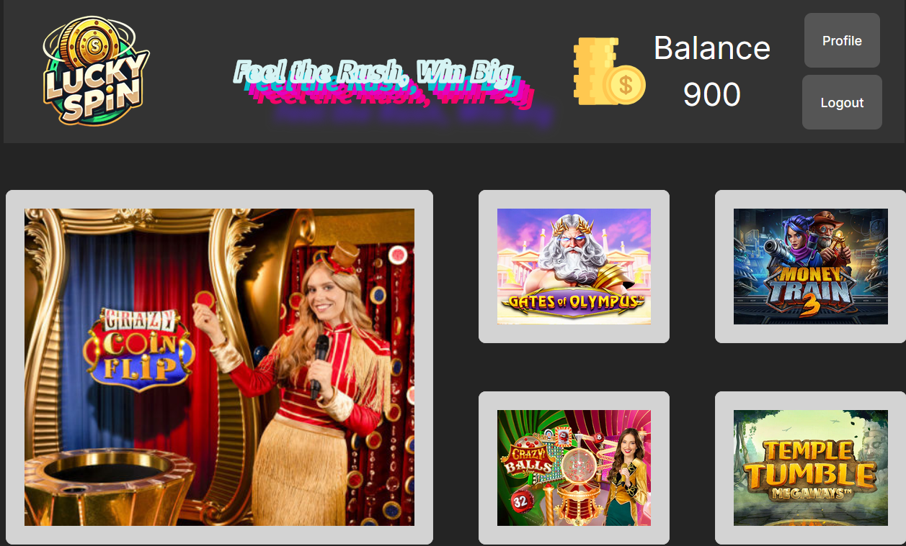
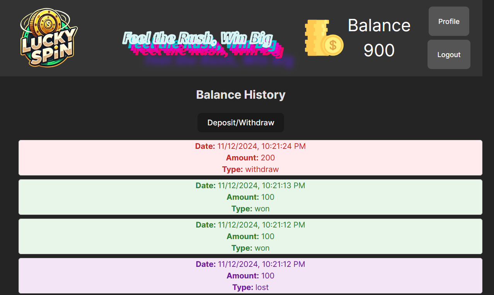

# LuckSpin


## Overview

This project is a demonstration of a full-stack, microservices-based application designed to showcase key backend and frontend skills. It consists of three primary components: an Authentication Service, a Gateway API, and a Frontend Application. The system implements secure user authentication, role-based access control, and balance management features. The architecture emphasizes modularity, secure communication, and scalability.


## Project Structure

### 1. Authentication Service

The Authentication Service is responsible for user sign-up, sign-in, and JWT-based authentication. User credentials are securely stored with hashed passwords, and a JWT token is issued upon successful sign-in. This service also includes error handling for scenarios such as duplicate usernames and token generation issues.

- **Endpoints**:
  - **POST `/signup`**: Registers a new user with a username, password, and role. Passwords are hashed using bcrypt before storage to ensure security.
  - **POST `/signin`**: Authenticates user credentials and issues a JWT token, valid for a defined duration.
- **Tech Stack**: Express, JWT, bcrypt, PostgreSQL.
- **Security**: The service includes password hashing and JWT-based token issuance, with a bearer authentication scheme. 

**Example Usage**:
- **Sign-Up**: Clients can register by providing a unique username, password, and role (e.g., "user" or "admin").
- **Sign-In**: The service returns a JWT token on successful login, which clients use to authenticate subsequent requests.

### 2. Gateway API

The Gateway API acts as a central hub for the application, facilitating communication between the frontend and the Authentication Service. It offers additional functionalities such as profile viewing, balance management, and a coin flip game. This API handles JWT-based authentication by verifying tokens and invalidating them upon logout.

- **Endpoints**:
  - **POST `/auth/signup`**: Interacts with the Authentication Service to create a new user. Initializes a starting balance and transaction history.
  - **POST `/auth/signin`**: Authenticates the user via the Authentication Service and sets a session cookie.
  - **GET `/auth/logout`**: Logs out the user by invalidating their JWT, stored in Redis to ensure it’s no longer accepted.
  - **GET `/user/profile`**: Retrieves user profile information, including balance and transaction history, accessible only by signed-in users.
  - **POST `/user/credit`**: Allows users to manage their balance, supporting deposit and withdrawal actions.
  - **POST `/play/coinflip`**: Users place a bet on a coin flip game; the balance updates based on the game result.
- **Tech Stack**: Express, JWT, Axios for internal API calls, Redis for JWT blacklisting, PostgreSQL for data persistence.
- **Security**: JWT tokens are validated for each protected route, and Redis is used to blacklist tokens on logout.

**Example Usage**:
- **Profile Management**: Users can view their balance and transaction history.
- **Balance Updates**: Users can deposit or withdraw funds, with each transaction updating their profile.
- **Coin Flip Game**: Users wager an amount on the game. Upon winning or losing, the balance updates accordingly.

### 3. Frontend Application

The Frontend is a React application that interacts with the Gateway API, offering a user-friendly interface for authentication, profile management, balance viewing, and gameplay. The app includes routing to manage user navigation, conditional rendering based on authentication status, and interactive components for user actions.
<p align="center">
  
  
</p>

- **Key Pages**:
  - **Sign In / Sign Up**: Allows new users to create accounts and existing users to sign in. Error messages are displayed for invalid credentials.
  - **Profile**: Shows the user’s balance and transaction history, with options to deposit or withdraw funds.
  - **Game**: A coin flip game where users can place bets. Navigation guards ensure users must be signed in to play.
- **Tech Stack**: React with TypeScript, React Router for page navigation, Axios for API requests, Context API for state management.
- **Design Considerations**: The application uses CSS for styling, with modular components to ensure a clean and maintainable codebase.

**Example Usage**:
- **Authentication**: New users sign up, and returning users sign in, receiving feedback on errors (e.g., incorrect credentials).
- **Profile Page**: Shows balance history and allows users to manage their balance.
- **Game Page**: Offers an interactive experience where users can play the coin flip game.

## Setup Instructions

### Prerequisites

- **Node.js and npm**: Ensure these are installed for managing dependencies and running the services.
- **PostgreSQL**: Required for data storage, with tables for users, balances, and transaction history.
- **Redis**: Used for JWT blacklisting, necessary to invalidate tokens on logout.

## Docker and Environment Configuration

This project uses Docker to containerize each service, allowing for modular development and deployment. Docker Compose orchestrates the services, creating a networked environment where each service can communicate securely.

### Docker Compose Configuration

The `docker-compose.yml` file defines five services:
1. **authapp** (Authentication Service)
2. **gateway** (Gateway API)
3. **luckyspin** (Frontend Application, built with Vite)
4. **postgres** (Database)
5. **redis** (Session management)

Each service requires specific environment variables for secure, functional operation.

### 1. **Authentication Service (authapp)**

Container Name: `authapp`

Environment Variables:
- **AUTH_PORT**: Port on which the authentication service runs (`4000` in this configuration).
- **DB_USER**: PostgreSQL username (e.g., `luckyspin_data_admin`).
- **DB_HOST**: PostgreSQL container name (`postgres`).
- **DB_NAME**: Name of the database (e.g., `luckyspin_data`).
- **DB_PORT**: PostgreSQL port (`5432`).
- **DB_PASS**: PostgreSQL password (e.g., `luckyspin_data_pwd`).
- **JWT_SECRET**: Secret key for JWT token generation (e.g., `jwt_secret`).

The **authapp** service also depends on **postgres** and **redis** to ensure that the database and session store are ready before it starts.
Ensure Docker is running, then navigate to the project root and run:
```bash
cd ./authenticator_service
npm install
npm run build
docker build -t auth-app .
```
### 2. **Gateway API (gateway)**

Container Name: `gateway`

Environment Variables:
- **AUTH_PORT**: Port where the authentication service is accessible (`4000`).
- **GATEWAY_PORT**: Port on which the gateway API will run (`31000`).
- **AUTHENTICATOR_URL**: URL of the Authentication Service (`http://authapp:4000`), allowing gateway to connect to `authapp` within the Docker network.
- **REDIS_HOST**: Redis container name (`redis`).
- **REDIS_PORT**: Redis port (`6379`).
- **DB_USER**: PostgreSQL username (same as authapp).
- **DB_HOST**: PostgreSQL container name (same as authapp).
- **DB_NAME**: Name of the database (same as authapp).
- **DB_PORT**: PostgreSQL port (same as authapp).
- **DB_PASS**: PostgreSQL password (same as authapp).
- **ALLOWED_ORIGINS**: Specifies allowed origins for CORS (e.g., `https://example.com`).
- **JWT_SECRET**: Secret key for JWT validation and authentication.

The **gateway** service relies on **authapp**, **redis**, and **postgres** to function correctly, ensuring each dependency is ready before starting.
```bash
cd ./gateway_service
npm install
npm run build
docker build -t gateway-app .
```

### 3. **Frontend Application (luckyspin)**

Container Name: `luckyspin`

The **luckyspin** service represents the frontend application, built with Vite. It is exposed on port `32000`, mapped to port `80` within the container for serving the frontend.

Environment Variables:
- The **luckyspin** service does not require additional environment variables, as it interacts with the backend services through the Gateway API.
```bash
cd ./authenticator_service
npm install
npm run build
docker build -t auth-app .
```

### 4. **PostgreSQL (postgres)**

Container Name: `postgres`

Environment Variables:
- **POSTGRES_DB**: Name of the PostgreSQL database (e.g., `luckyspin_data`).
- **POSTGRES_USER**: Username for PostgreSQL (e.g., `luckyspin_data_admin`).
- **POSTGRES_PASSWORD**: Password for PostgreSQL (e.g., `luckyspin_data_pwd`).

### 5. **Redis (redis)**

Container Name: `redis`

The **redis** service serves as the session store and caching layer for the application. No additional environment variables are needed beyond the default Redis configuration.

### Running the Containers

1. **Build and Start**:
   Ensure Docker is running, then navigate to the project root and run:
   ```bash
   docker-compose up -d postgres
   ```
   This command will start up postgres. You will need to set up your databases first.
   ```bash
   sudo docker-compose exec postgres
   psql -U luckyspin_data_admin -d luckyspin_data 
   ```
   ```sql
    CREATE TABLE users (
    id SERIAL PRIMARY KEY,
    username VARCHAR(100) UNIQUE NOT NULL,
    password VARCHAR(100) NOT NULL,
    role VARCHAR(100) NOT NULL
    );

    CREATE TABLE user_balance (
    user_id INT REFERENCES users(id) PRIMARY KEY,
    balance INT NOT NULL CHECK (balance >= 0)
    );

    CREATE TABLE balance_history (
    id SERIAL PRIMARY KEY,
    user_id INT REFERENCES users(id),
    date TIMESTAMP DEFAULT CURRENT_TIMESTAMP,
    amount INT NOT NULL,
    type VARCHAR(50) CHECK (type IN ('lost', 'won', 'deposit', 'withdraw'))
    );

    GRANT ALL PRIVILEGES ON DATABASE luckyspin_data TO luckyspin_data_admin;
    GRANT SELECT, INSERT, UPDATE, DELETE ON TABLE users, user_balance, balance_history TO luckyspin_data_admin;
    GRANT USAGE, SELECT ON SEQUENCE users_id_seq TO luckyspin_data_admin;
    GRANT USAGE, SELECT ON SEQUENCE balance_history_id_seq TO luckyspin_data_admin;
    ```

    You will need to do this only once, then you can safely start other services.

    ```bash
    docker-compose up -d
    ```

2. **Access Points**:
   - **Frontend Application (luckyspin)**: Accessible at `http://localhost:32000`.
   - **Gateway API**: Accessible at `http://localhost:31000`.
   - **Authentication Service**: Runs internally on port `4000` and is accessible to the gateway.

### Additional Notes

- **Data Persistence**: PostgreSQL and Redis containers are configured with persistent storage volumes (`postgres-data` and `redis-data`) to retain data even if the containers are stopped or restarted.

## Setting Up Kubernetes 
If you want to user K8 instead of docker-compose, you can follow the steps.

### Step 1: Configure PostgreSQL

1. **Apply the PostgreSQL Configuration**: Start by applying the `postgres-config.yaml` file. This file configures the PostgreSQL deployment and exposes it as a service.
   
   ```bash
   kubectl apply -f postgres-config.yaml
   ```

2. **Manually Initialize the Database**:
   After the PostgreSQL pod is running, you’ll need to initialize the database manually.

   - First, get the pod name:
     ```bash
     kubectl get pods
     ```

   - Once you have the PostgreSQL pod name, access it:
     ```bash
     kubectl exec -it <postgres_pod_name> -- bash
     ```

   - Inside the pod, connect to PostgreSQL:
     ```bash
     psql -U luckyspin_data_admin -d luckyspin_data
     ```

   - Run the SQL initialization script (if it’s available in the pod):
     ```sql
     \i /docker-entrypoint-initdb.d/init.sql
     ```
   
   - Exit the PostgreSQL shell and the pod.

### Step 2: Configure Redis

Apply the Redis configuration file to start Redis in your cluster:

```bash
kubectl apply -f redis-config.yaml
```

This will set up Redis and expose it for internal communication between services.

### Step 3: Deploy the Authentication Service

Now, deploy the `authapp` service. This service relies on both PostgreSQL and Redis, so ensure those are working before proceeding.

```bash
kubectl apply -f authapp-config.yaml
```

This file includes the environment variables and secrets needed for authentication, as well as the connection details for Redis and PostgreSQL.

### Step 4: Deploy the Gateway Service

With the authentication service running, deploy the gateway application to handle incoming requests.

```bash
kubectl apply -f gatewayapp-config.yaml
```

This service acts as a reverse proxy to route requests between the authentication service and the other parts of the application.

### Step 5: Deploy the Main Application (LuckySpin)

Finally, deploy the primary application using the `luckyspin-config.yaml` file.

```bash
kubectl apply -f luckyspin-config.yaml
```

This service includes any additional configurations specific to your application, such as environment variables, external APIs, or access to Redis and PostgreSQL.

## Verifying and Managing Your Deployment

1. **Check Pod Status**:
   Ensure each service is running by checking the pod status:
   ```bash
   kubectl get pods
   ```

2. **View Logs**:
   If a pod is not working as expected, check its logs for errors:
   ```bash
   kubectl logs <pod_name>
   ```

3. **Accessing Services**:
   If your services are configured with `NodePort` or an ingress, you can access them externally. For debugging, you might also forward a local port to a service:
   ```bash
   kubectl port-forward <pod_name> <local_port>:<pod_port>
   ```

### Notes

- Ensure that your YAML configurations include correct environment variables, volume mounts, and any necessary service dependencies.
- If you're updating any configuration, redeploy by reapplying the modified YAML file:
  ```bash
  kubectl apply -f <config_file>.yaml
  ```


## Future Improvements

Potential enhancements include:
- **Additional Games**: Adding more games for users to engage with and potentially win or lose funds.
- **Role-Based Access Control**: More granular roles, such as an admin user with privileges to view all users and their balances.
- **Enhanced UI**: A more polished frontend with animations and improved responsiveness.
- **Notifications**: Real-time updates for user balance changes and game outcomes.
